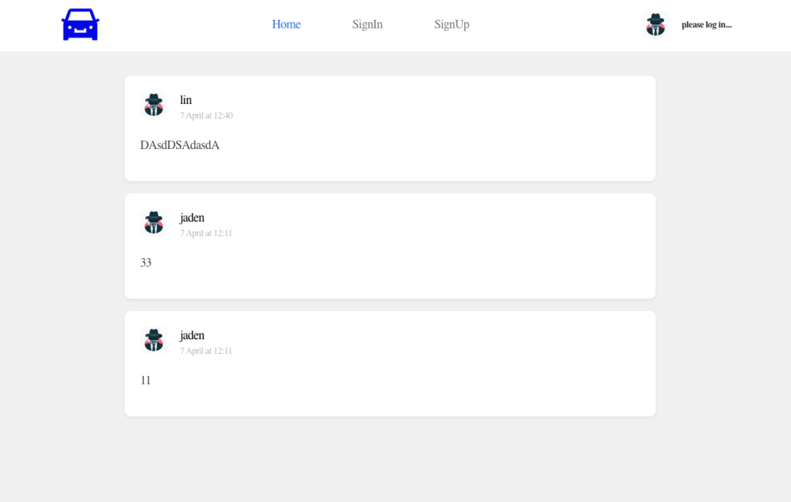
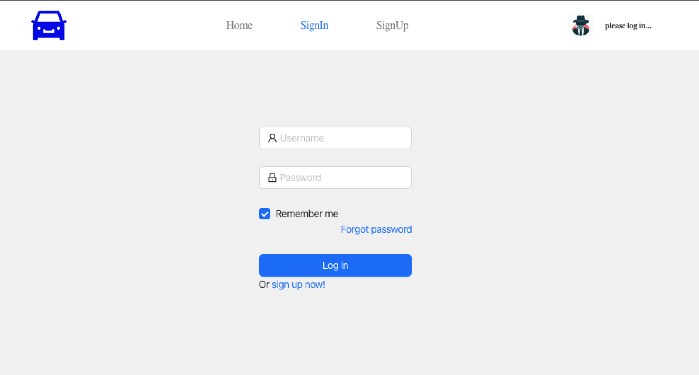
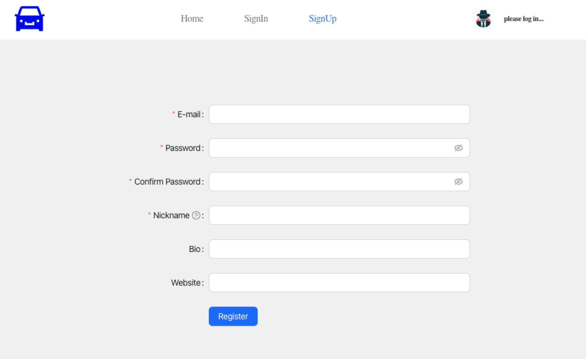
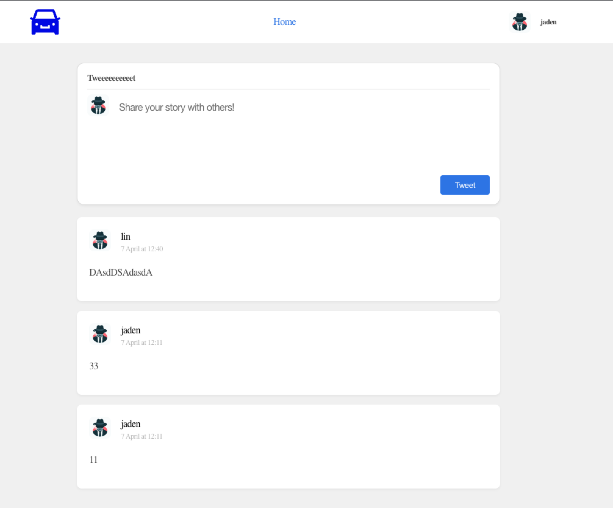
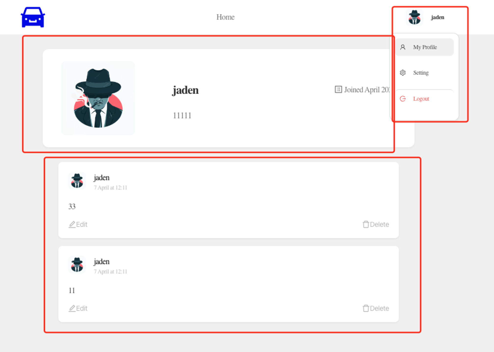
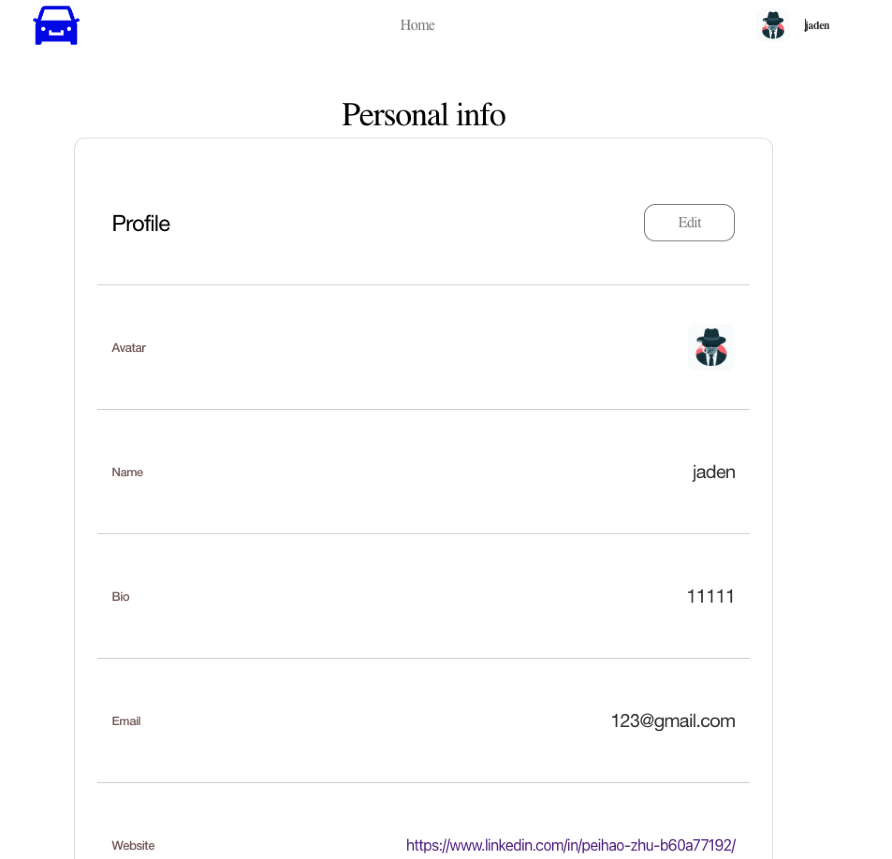
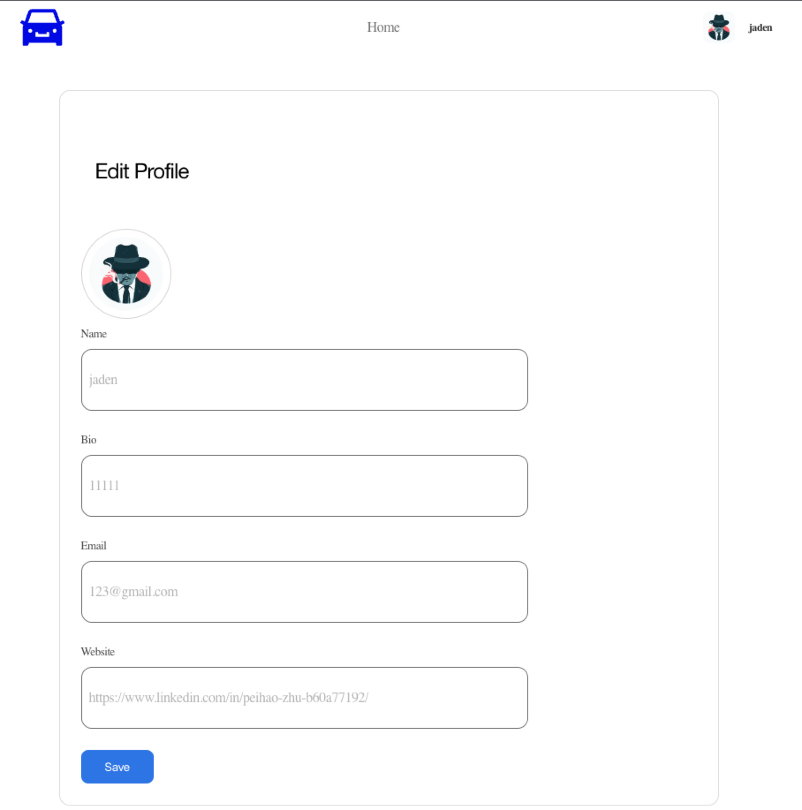

# TruthTwitter

A social media that has similar layout of Twitter and is implemented with MERN stack(MongoDB, Express, React and Node)

## Project Structure

There are three folders: img, twitter-frontend and twitter-backend

- img: All images README.md will use
- twitter-frontend: A single React application to display all pages, all codes are written under src subfolder. index.js is the entry point of the application
  - React application is depoyed in Firebase hosting

* twitter-backend: A single Node server to offer RESTful API and interact with MongoDB through Mongoose (an ORM framrwork).
  - functions: Node server is running on Firebase Cloud Function
    - index.js: just like the server.js in normal Node.js server
    - controller: define all RESTful API
    - model: define the dataset schema of MongoDB and implement the service code to insert, query, delete and update the dataset.
  - Node server is deployed in Firebase Cloud Function

## Website URL

```
https://peihao-twitter.web.app/
```

## Feature Demo

### Homepage for all users



### Login page



### Register page



### Homepage for loged in user



### User-profile page



### User setting page



### Update setting page



## How to run it locally

1. Download the code
2. cd twitter-frontend folder

   - run `npm install`
   - go to src/config/config.js and change the baseUrl to your local url where your server will be deployed
   - run `npm start`

3. cd twitter-backend/functions
   - run `npm install`
   - go to index.js file and uncomment line 47 ~ 49. You can change the port you want; replace the front-end url(ip:port) with your local url in line 38
   - run `node index.js`

4) want to deploy separate applications into firebase?

   refer to this post: https://javascript.plainenglish.io/hosting-your-react-js-and-node-js-apps-for-free-with-firebase-6dc670564aca
